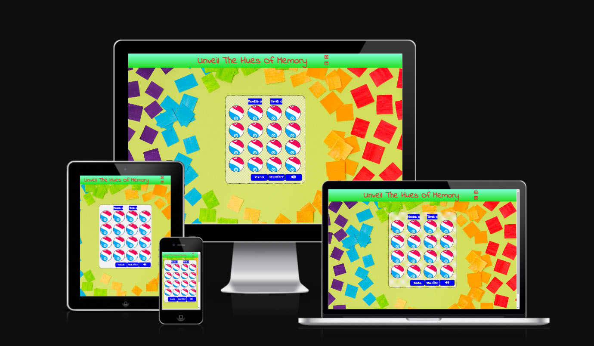
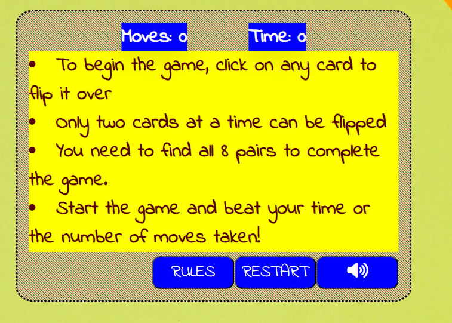

# [Unveil The Hues Of Memory](#unveil-the-hues-of-memory)

Memory card games have long captured the hearts and minds of people of all ages around the world. These delightful games, also known as concentration or matching games, challenge our cognitive abilities while providing hours of entertainment. Whether you're a child sharpening your memory skills or an adult seeking a fun mental workout, memory card games offer an engaging and accessible way to exercise your brain.

Welcome to the [Unveil The Hues Of Memory](https://naisepaul.github.io/Javacript-project/). This Readme file provides an overview of my second project- *Interactive Front-End Development* . Please read through this documents to familiarize everyone with featues and guildlines.

## Table of Contents

- [Unveil The Hues Of Memory](#unveil-the-hues-of-memory)
  - [Table of Contents](#table-of-contents)
- [UX](#ux)
  - [Website Owner Goals](#website-owner-goals)
  - [User goals](#user-goals)
  - [User Stories](#user-stories)
  - [Structure of the Website](#structure-of-the-website)
  - [Wireframes](#wireframes)
  - [Surface](#surface)
    - [Colors](#colors)
    - [Fonts](#fonts)
    - [Images](#images)
  - [Features](#features)
    - [Game Grid](#game-grid)
    - [Game Information](#game-information)
    - [Navigation buttons](#navigation-buttons)
    - [Instruction](#instruction)
    - [Game won](#game-won)
  - [Future Features](#future-features)
  - [Technology Used](#technology-used)
    - [HTML 5](#html-5)
    - [CSS](#css)
    - [JavaScript](#javascript)
    - [Font Awesome](#font-awesome)
    - [Google fonts](#google-fonts)
    - [GitHub](#github)
    - [Wireframe.cc](#wireframecc)
    - [Photoshop](#photoshop)
    - [Lighthouse](#lighthouse)
    - [Google Chrome Development Tools](#google-chrome-development-tools)
    - [favicon.io](#faviconio)
  - [Testing](#testing)
    - [Functionality testing](#functionality-testing)
    - [Compatibility testing](#compatibility-testing)
    - [Issues found during site development](#issues-found-during-site-development)
    - [Mobile screen compatability](#mobile-screen-compatability)
    - [Horizontal scrolling bar on the bottom of the page](#horizontal-scrolling-bar-on-the-bottom-of-the-page)
    - [Performance testing](#performance-testing)
      - [Desktop Results](#desktop-results)
      - [Mobile Results](#mobile-results)
  - [Code Validation](#code-validation)
  - [Deployment](#deployment)
  - [Credits](#credits)
    - [Code](#code)
    - [content](#content)
    - [Icons](#icons)
    - [Images](#images-1)
    - [Screenshots](#screenshots)
  
# UX

## Website Owner Goals

- Entertainment:
    The primary goal for memory card game  is to provide entertainment to my users. I want to create an enjoyable and engaging experience that keeps visitors coming back to play the game.

## User goals

- Entertainment:
  
    Many users visit memory card game websites to have fun and pass the time. Their primary goal is to enjoy the game and be entertained by the gameplay.

- Challenge:
    Memory card games often require memory and concentration, and some users are drawn to the challenge of matching pairs efficiently. Their goal is to test and improve their memory and cognitive skills.

- Relaxation:
  
   For some users, playing memory card games serves as a way to relax and unwind. They may visit the website to take a break from their daily routine or reduce stress.

## User Stories

- The user should see a grid style game with cards on display these cards will have a front and back image.
- The user should only be able to click on two cards at a time, to try to find a matched pair of colors.
- Once the first card has been flipped and when the second card has been flipped a move is logged.
- The user should expect that once the game has been completed, the timer will stop.
- The user should be receiving a message to confirm their win and score at the end of the game when all matched pairs have been found.
- The user should have the option to reset the game at any time during play.
- By playing this game the user should be able to test their memory skill in a fun environment.

## Structure of the Website
  
The website is meticulously crafted to ensure a seamless and intuitive user experience across all types of devices. Whether accessed on a desktop computer, tablet, or mobile device, users can expect a phenomenal browsing experience with no discernible differences. Every element of the website is thoughtfully designed and optimized to deliver utmost user satisfaction and ensure that individuals can effortlessly navigate and interact with the site, regardless of the device they are using. The goal is to create a consistently outstanding user experience that transcends the boundaries of different devices.

[Back to Table of contents](#table-of-contents)

## Wireframes

I used wireframe.cc to create wireframes

[Front Page - Desktop & Mobile](assets/images/readme-images/wireframe-front.png)

[win - Desktop & Mobile](assets/images/readme-images/wireframe-win.png)

[Instruction - Desktop & Mobile](assets/images/readme-images/wireframe-instr.png)

## Surface

### Colors

Colors used in this project

Social Media link, h1 - rgb(229, 43, 43)

Header background - rgb(31, 223, 31), aquamarine

cards border - rgb(78, 39, 82)

cards hover - black

button background - blue, white

button hover - yellow, black

Instructions - rgb(89, 6, 6)

Instructions background-color - Yellow

Cards -  red, blue, green, yellow, teal, cyan, grey, pink

### Fonts

- for whole body I used indie flower

### Images

- I used www.freepik.com for downloding images.

## Features

Memory card games, also known as matching games, are popular card games that typically involve matching pairs of cards with identical images or patterns. These games are often used for entertainment and memory improvement.

### Game Grid

The game layout has been kept simple, using a 4x4 style grid, with a total of 16 cards. I felt that this number of cards was the most suitable in order to keep the game responsive for smaller devices.

### Game Information

The game timer is activated once it press start button. The moves tracker  counter starts the count when the second card had been flipped.

### Navigation buttons

 "Instruction" button was not originally planned for this game. However, once I had completed the game, I felt an additional button beside the game start button, would allow for a more positive user experience, if the user had the option to see the game instructions.

### Instruction

I added instruction details in a yellow background to see the details clearly.

### Game won

I added game won details simply "you won " with winning moves and timer.

## Future Features

I would like to add different difficulty styles like easy, medium and hard.

I would like to add a high score leader board to the game to allow the user to add their name and record the moves and time.

[Back to Table of contents](#table-of-contents)

## Technology Used

### HTML 5

- As a structure language

### CSS

- As a style language
  
### JavaScript  

- For the logic of the game. To manipulate the HTML and CSS on the screen.

### Font Awesome

- As an icon library for social media links

### Google fonts

- As a font resource

### GitHub

- As a software hosting platform to keep project ina remote location

### Wireframe.cc

- As a wireframing tool

### Photoshop

- As an Image editor
  
### Lighthouse

- Testing code health, accessibility, speed and search engine optimisation..

### Google Chrome Development Tools

- Testing code on various device sizes during development and debugging.
  
### favicon.io  

- For  favicon generating

[Back to Table of contents](#table-of-contents)

## Testing

### Functionality testing

I used Chrome developer tools and Microsoft Edge through out the project for testing and solving problems with responsiveness and style issues.

### Compatibility testing

Website was tested multiple virtual mobile and tablet devices and browser.

### Issues found during site development

- Getting cards backside
- Instruction details was on columns, after removing the class cards insructions shown in rows.
- Timer ending when game is finish. Give a variable to the setintravel clears the problem.
  
- Making the container in the center.

### Mobile screen compatability

I found many bugs when I use different size of mobile devices.

- Changing card size and font size of headings fixed the problems.
  
- changing the game won class width in smaller devices.

### Horizontal scrolling bar on the bottom of the page

- changing the card size solved the problems for mobile devices. It took half an hour to understand the problem.

### Performance testing

I run Lighthouse within the Chrome Developer Tools to test the performance, accessibility, best practices and SEO of the website.

#### Desktop Results

Final results

#### Mobile Results

Final results

## Code Validation

I used 3 website to validate

1. CSS Validator <https://jigsaw.w3.org/css-validator/>
2. HTML Validator <https://validator.w3.org/>
3. Javascript  <https://jshint.com>

[Back to Table of contents](#table-of-contents)

## Deployment

The project was deployed on GitHub pages. I used codeanywhere as a development environment where I commited all changes to git version control system.

I used push command in codeanywhere to save changes into GitHub.

To deploy the project I had to :

- Log in to GitHub and click on repository to deploy [Memory game](https://naisepaul.github.io/Javacript-project/)!
- Select `settings` and find GitHub `pages` section on the left side bar.
- From source select `Deploy from a branch` and then select `main` branch
- Click `save` and page was deployed after refresh

Site is published at <https://naisepaul.github.io/Javacript-project/>

[Back to Table of contents](#table-of-contents)

## Credits

To complete this project I used Code institue student template: [Gitpod full template](https://github.com/Code-Institute-Org/gitpod-full-template)

- My mentor
  
- Ideas and knowledge library:
  
- [Game Board](https://www.youtube.com/watch?v=HCIFLBUldW8&t=2050s)

- [w3schools.com](https://www.w3schools.com)
- [css-tricks.com](https://css-tricks.com/)

- [stackoverflow.com](https://stackoverflow.com/)

### Code

- [double the array](https://www.youtube.com/watch?v=bznJPt4t_4s&t=742s)
- [Game Board](https://www.youtube.com/watch?v=HCIFLBUldW8&t=2050s)
- [centering the content]( https://www.youtube.com/watch?v=dqqxkrKhfS4&t=1873s)
- [openai](openai.com)

### content

- [memory game](https://github.com/moirahartigan/Portfolio-2---Alien-Memory-Game)

### Icons

- [font Owsome version 4.7.0](https://fontawesome.com/)

### Images

- www.freepik.com
- for pattern <https://pattern.monster/>

### Screenshots

 
 
 [Back to Table of contents](#table-of-contents)
